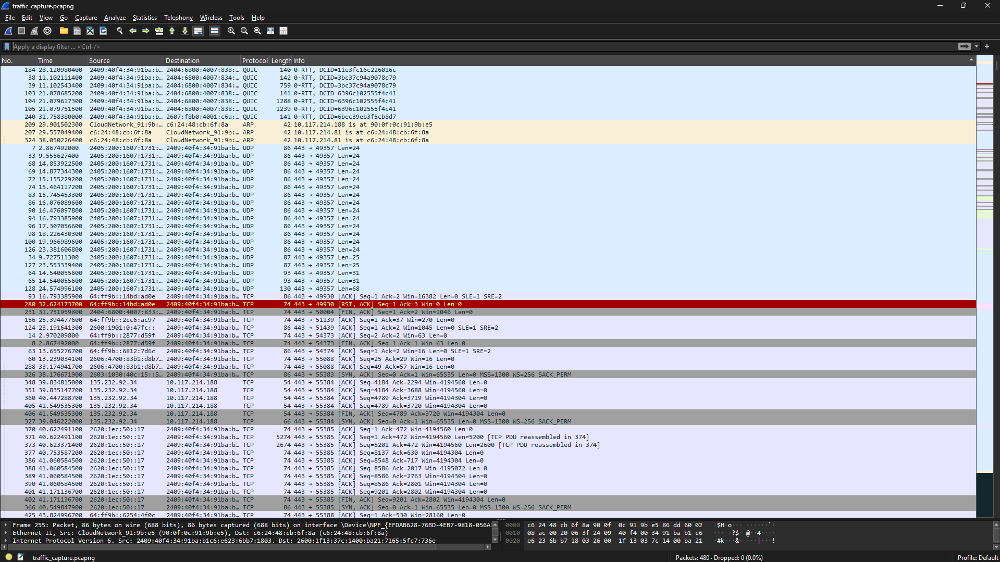
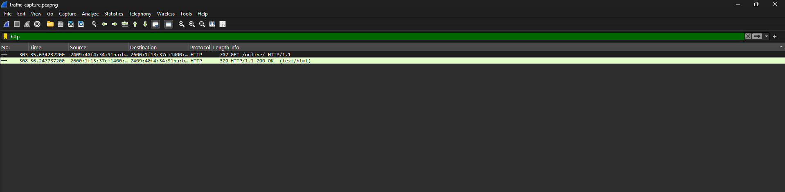
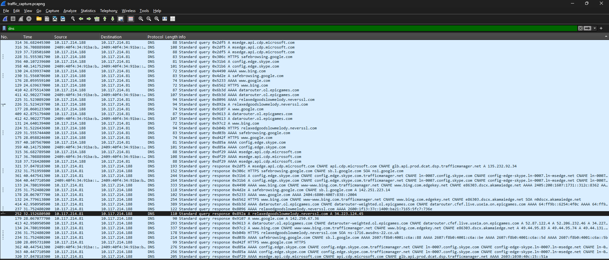
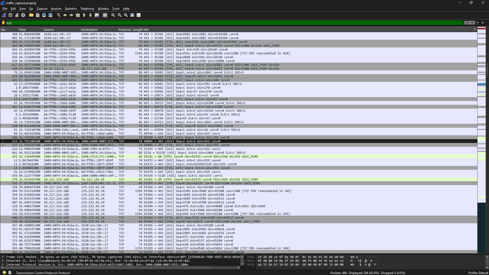
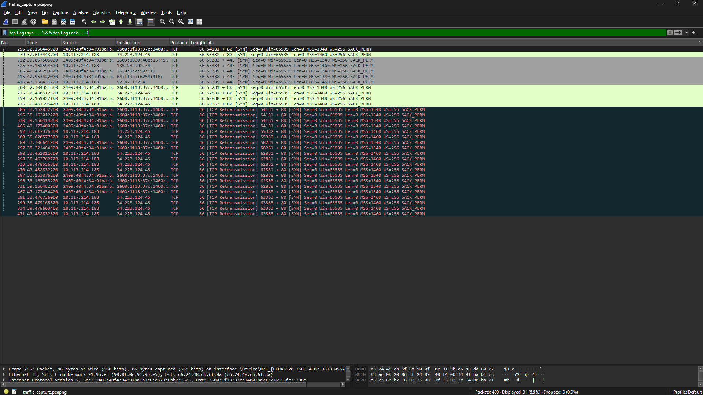

# 🔎 Network Traffic Analysis

> Capture and analyze network traffic to identify unusual patterns, malware communication, or signs of potential cyber attacks.

---

## 🎯 Objective

The objective of this project is to capture and analyze network packets to understand how devices communicate on a network and to detect any unusual or suspicious behavior.

---

## 🛠 Tools Used

| Tool | Purpose |
|-----|--------|
| **Wireshark** | Capture and analyze network packets |
| **tcpdump** | Command-line packet capturing tool |
| **Snort** | Intrusion Detection System for detecting malicious traffic |

---

## 🧠 Skills Learned

- Packet sniffing  
- Network traffic analysis  
- Understanding TCP/IP protocols  
- Detecting suspicious network activity  
- Using Wireshark filters for investigation  

---

# 📡 Network Traffic Capture

Wireshark was used to capture live network packets from the active network interface.  
The captured packets included different protocols such as:

- TCP  
- UDP  
- QUIC  
- ARP  

Each packet contains information such as:

- Source IP address  
- Destination IP address  
- Protocol used  
- Packet size  
- Communication details  

### 📷 Packet Capture Screenshot

---

# 🌐 HTTP Traffic Analysis

### Filter Used

This filter displays **HTTP protocol packets**, which represent communication between a web browser and a web server.

During the capture:

- A **GET request** was sent from the client to request a webpage.
- The server responded with **HTTP/1.1 200 OK**, indicating successful communication.

### 📷 HTTP Filter Screenshot

---

# 🌍 DNS Traffic Analysis

### Filter Used

DNS (Domain Name System) converts domain names into IP addresses so devices can communicate.

During the capture, DNS queries were observed for domains such as:

- google.com  
- bing.com  
- microsoft services  
- epicgames.com  

DNS traffic analysis is important because **malware often communicates with suspicious domains**.

### 📷 DNS Filter Screenshot

---

# 🔗 TCP Traffic Analysis

### Filter Used

TCP (Transmission Control Protocol) is responsible for reliable communication between devices.

During the capture, several TCP flags were observed:

| TCP Flag | Purpose |
|--------|---------|
| SYN | Initiates a connection |
| ACK | Acknowledges received packets |
| FIN | Terminates a connection |

Most TCP traffic was observed on **port 443 (HTTPS)**, indicating encrypted web communication.

### 📷 TCP Filter Screenshot

---

# 🚨 SYN Packet Detection (Connection Attempts)

### Filter Used

This filter displays **SYN packets**, which are used to initiate TCP connections.

A high number of SYN packets may indicate:

- Port scanning  
- Network probing  
- Potential attack attempts  

In this capture, SYN packets were observed as part of normal connection establishment between the client and remote servers.

### 📷 SYN Packet Screenshot

---

# 📊 Observations

During the network analysis, the following protocols were commonly observed:

- TCP  
- DNS  
- HTTP  
- UDP  

Most traffic was generated by **normal browsing activity and system services**.

No clear malicious traffic patterns were identified during the capture session.

---

# 🏁 Conclusion

Network Traffic Analysis plays a crucial role in cybersecurity by helping security professionals monitor network activity and detect abnormal behavior.

Using Wireshark, network packets can be captured and analyzed in detail to understand communication patterns and identify potential threats.

This project demonstrated how packet capture and filtering techniques can be used to analyze network traffic and observe connection attempts.

---

